# Three-Tier Architecture on AWS with Terraform

A practice project building a production-style three-tier architecture on AWS using Terraform as Infrastructure as Code (IaC).

## Architecture Overview

```
                        Internet
                           │
                    [Internet Gateway]
                           │
              ┌────────────┴────────────┐
              │       Public Subnets     │
              │  web_public_A (eu-north-1a) │
              │  web_public_B (eu-north-1b) │
              │                         │
              │  [Bastion Host]  [ALB]  │
              └────────────┬────────────┘
                           │
                    [NAT Gateway]
                           │
              ┌────────────┴────────────┐
              │    App Private Subnets   │
              │  app_private_A (eu-north-1a) │
              │  app_private_B (eu-north-1b) │
              │                         │
              │  [App Instance]  [ASG]  │
              └────────────┬────────────┘
                           │
              ┌────────────┴────────────┐
              │     DB Private Subnets   │
              │  db_private_A (eu-north-1a) │
              │  db_private_B (eu-north-1b) │
              │                         │
              │      [DB Instance]      │
              └─────────────────────────┘
```

## Resources Created

| Resource | Name | Description |
|---|---|---|
| VPC | Three_Tier_VPC | 10.0.0.0/16 |
| Subnets | web_public_A/B | Public subnets for ALB and Bastion |
| Subnets | app_private_A/B | Private subnets for App layer |
| Subnets | db_private_A/B | Private subnets for DB layer |
| Internet Gateway | Three_Tier_IGW | Public internet access |
| NAT Gateway | Three_Tier_NAT | Outbound access for private subnets |
| Elastic IP | Three_Tier_NAT_EIP_A | NAT Gateway EIP |
| Route Tables | Public + Private | Traffic routing |
| Security Group | Three_Tier_Web_SG | Ports 22, 80, 443, 8080 |
| Security Group | Three_Tier_App_SG | Ports 22, 80, 443, 8080 from Web SG |
| Security Group | Three_Tier_DB_SG | Ports 22, 3306 from App SG |
| ALB | Three-Tier-ALB | Public Application Load Balancer |
| Target Group | Three-Tier-App-TG | Port 8080 HTTP |
| ALB Listener | Three_Tier_ALB_Listener | HTTP:80 → Target Group |
| Launch Template | Three_Tier_App_LC | Ubuntu 22.04, t3.micro |
| Auto Scaling Group | Three_Tier_App_ASG | Min:1, Desired:1, Max:2 |
| EC2 Instance | Three_Tier_Bastion_Instance | Bastion host in public subnet |
| EC2 Instance | Three_Tier_Web_Instance | Web server in public subnet |
| EC2 Instance | Three_Tier_App_Instance | App server in private subnet |
| EC2 Instance | Three_Tier_DB_Instance | DB server in private subnet |

## Project Structure

```
terraform-three-tier-architecture/
├── main.tf           # All infrastructure resources
├── provider.tf       # AWS provider and Terraform config
├── variables.tf      # Input variable declarations
├── terraform.tfvars  # Variable values (not committed to git)
├── output.tf         # Output values after apply
└── README.md         # This file
```

## Prerequisites

- [Terraform](https://developer.hashicorp.com/terraform/install) installed
- [AWS CLI](https://aws.amazon.com/cli/) installed and configured
- An AWS account with appropriate permissions
- An EC2 Key Pair created in `eu-north-1`

## Usage

1. Clone the repository:
```bash
git clone <repo-url>
cd terraform-three-tier-architecture
```

2. Create your `terraform.tfvars` file (not included in repo):
```hcl
key_name = "your-key-pair-name"
```

3. Initialise Terraform:
```bash
terraform init
```

4. Preview the changes:
```bash
terraform plan
```

5. Deploy the infrastructure:
```bash
terraform apply
```

6. Destroy when done (important - avoids unnecessary costs):
```bash
terraform destroy
```

## Outputs

After a successful `terraform apply` you will see:

| Output | Description |
|---|---|
| `vpc_id` | The ID of the VPC |
| `alb_dns_name` | DNS name to access the application |
| `bastion_public_ip` | Public IP to SSH into the bastion host |
| `nat_gateway_ip` | Elastic IP of the NAT Gateway |

## Lessons Learned

- AMI IDs are **region-specific** — always verify the correct AMI for your target region
- Key pairs are **region-specific** — a key pair in eu-west-1 does not exist in eu-north-1
- `aws_autoscaling_group` uses `tag {}` blocks (singular), not `tags = {}` map
- `aws_launch_template` requires `security_groups` inside a `network_interfaces {}` block
- ALB and Target Group names only support **hyphens**, not underscores
- Health check `timeout` must be **less than** `interval`
- `aws_db_instance` uses `db_name` not `name` (deprecated in AWS provider v5+)
- `terraform.tfvars` should never be committed to git as it contains sensitive values
- Always run `terraform destroy` after practice to avoid unexpected AWS costs

## Screenshots

### Terraform Apply
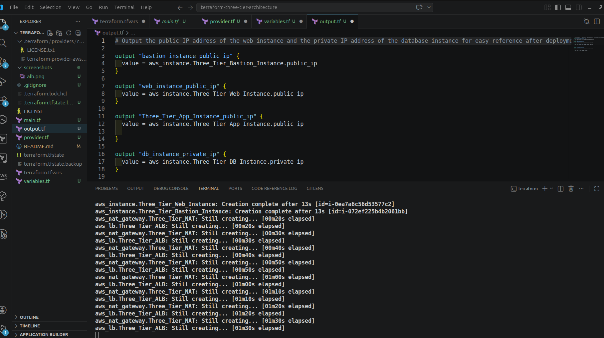
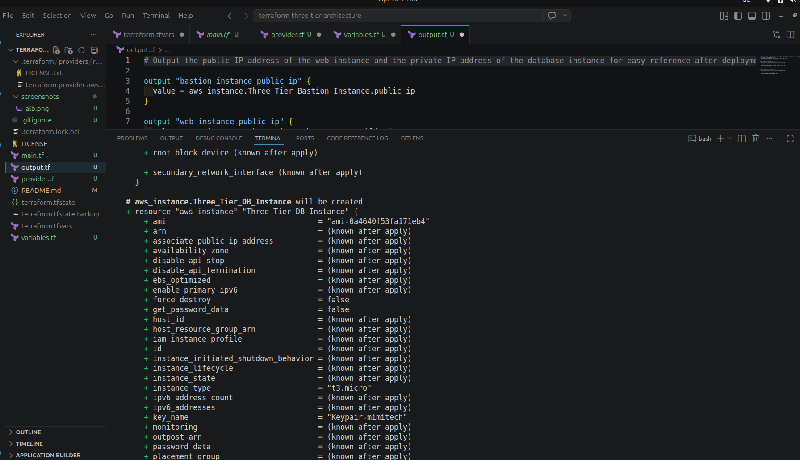
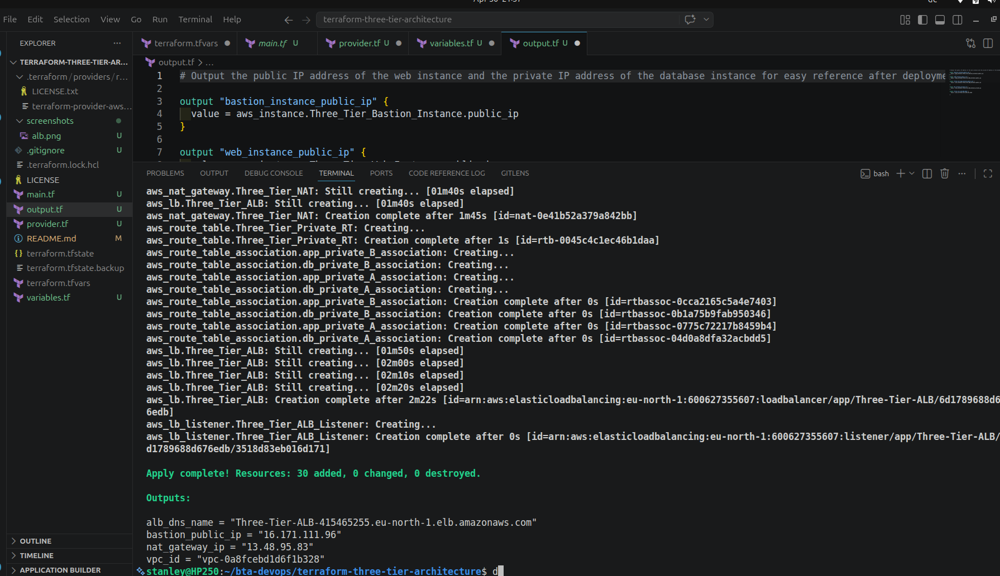

### VPC & Networking
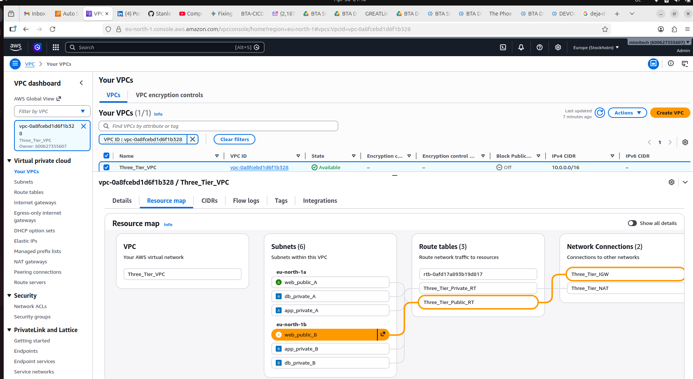
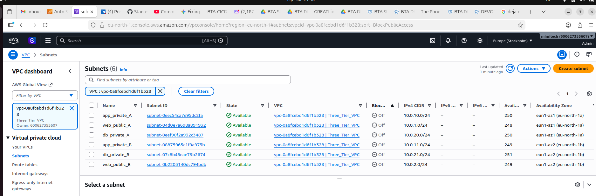
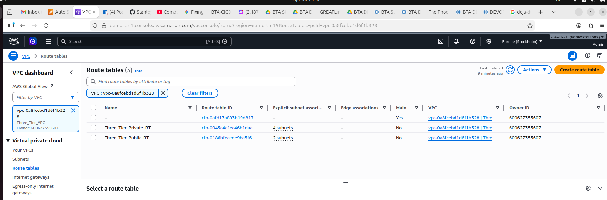
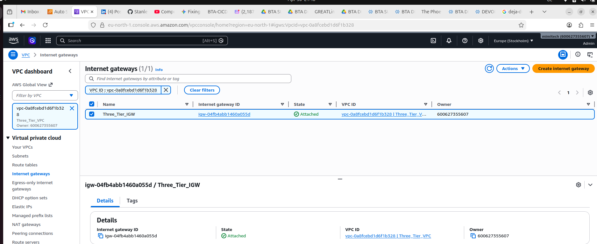
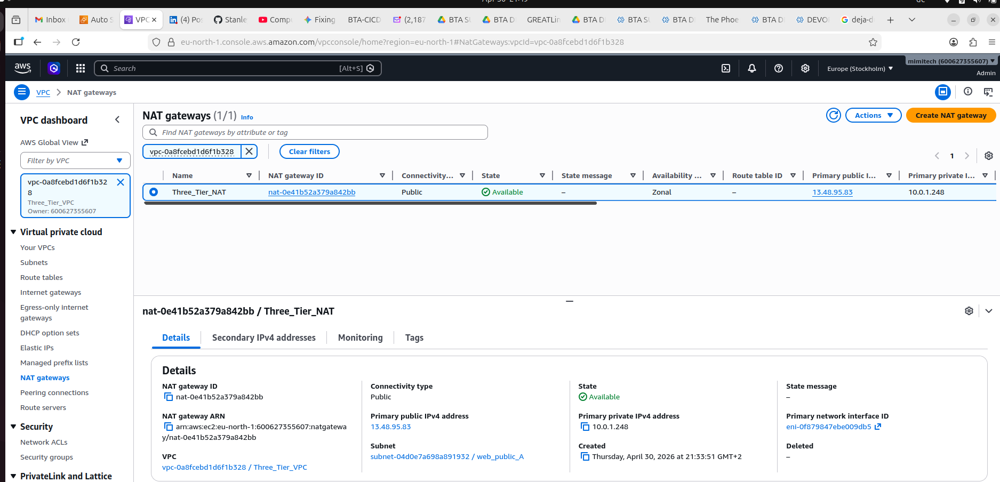

### Security Groups
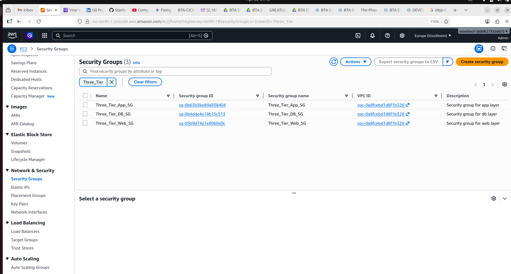

### Load Balancer & Auto Scaling
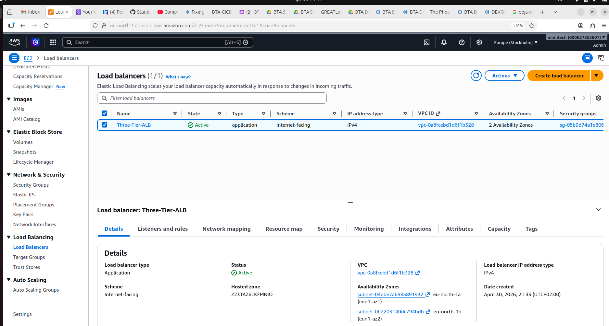
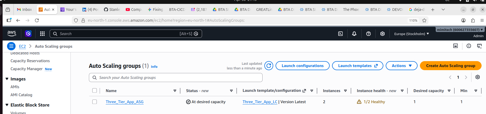
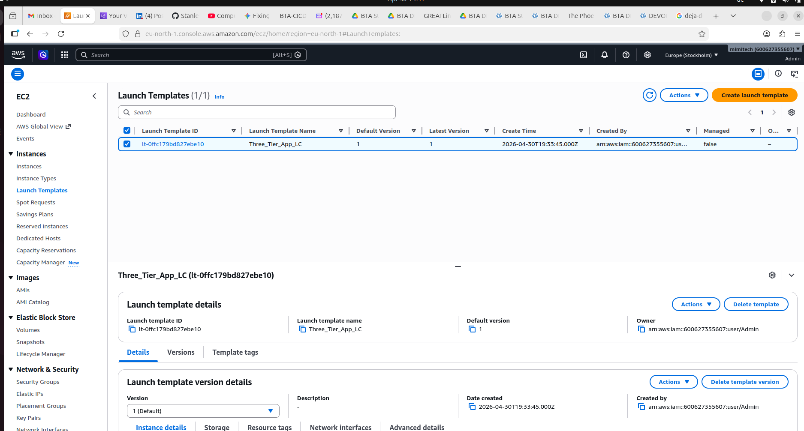

## Region

All resources are deployed in **eu-north-1 (Stockholm)**
